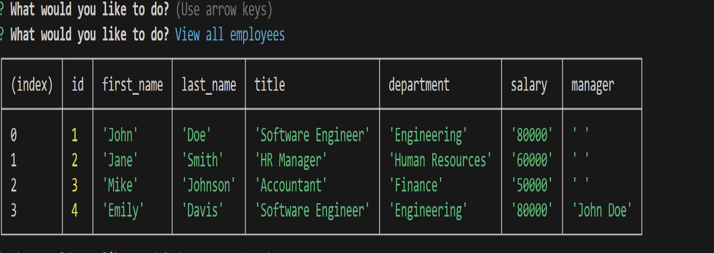
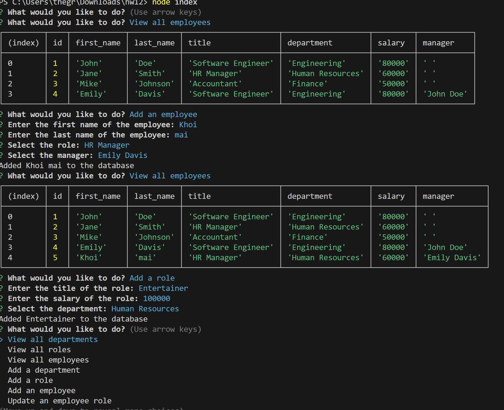

# 12 SQL: Employee Tracker

## Description
Use inquirer and pg to create a company database with employees, their roles and department. Then I am able to view all employees and their roles and what department they are in. I am also able to add department, role and employees and their mannagers.
## Table of Contents
- [Installation](#installation)
- [Usage](#usage)
- [Contributing](#contributing)
- [Tests](#tests)
- [License](#license)
- [Questions](#questions)

## Installation
You need to npm i to install inquirer 8.2.4 and pg in order to run the program using node index. Then there will be a list to navigate to all the options

## Usage
This can be use to create a company database to manage the employees
## Contributing

## Tests
node index to start the test and view all the options

## License

No license

## Media
### Example Photo

### Example Video
[Watch the Video]()

* The URL of the deployed application.
[link to the website]

## Questions
If you have any questions, please reach out to me:

GitHub: [thegreatwall88](https://github.com/thegreatwall88)
Email: thegreatwall88@gmail.com
